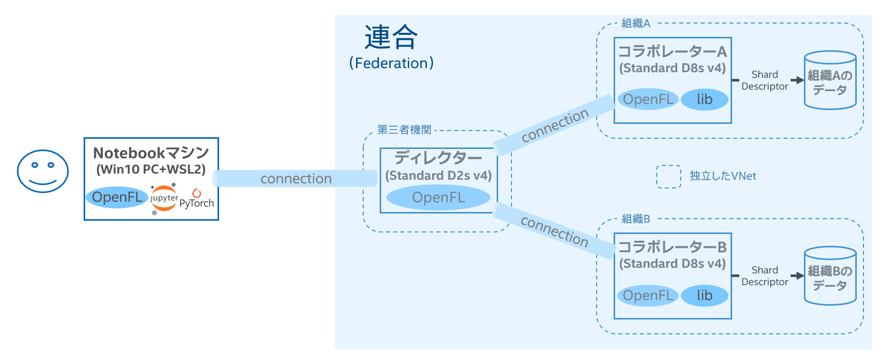

# Federated Learning 事始め
Intel(R) OpenFLを使用してFederated Learningを初めて動かすチュートリアルです。Azureの使用を前提としています。

Federated Learningの第一歩として、Torchvisionにて提供されているMobileNet v2をImagenetのデータでFine Tuningするサンプルです。Directorノード1台、Envoyノード2台をそれぞれAzure VMを使用して動かします。
 
## Getting Started / スタートガイド
下記のような環境を構築していきます。
 
### Prerequisites / 必要条件
#### Director ノード
- インスタンスタイプは問わないが、デモでは「Standard D2s v4」を使用
- OS: Ubuntu 20.04
- Python: 3.8
#### Envoy ノード
- インスタンスタイプは問わないが、デモでは「Standard D8s v4」を使用
- OS: Ubuntu 20.04
- Python: 3.8
#### Notebook ノード（ローカルPC）
- Intel CPU（Core or Xeon）を搭載したマシン
    - Core: 第10世代以上
    - Xeon: 第2世代Xeonスケーラブル・プロセッサー以上
- OS: Windows 10
- WSL2でUbuntu
- Docker（※以下にインストール手順記載）
- Python: 3.8

### Directorノードのセットアップ
#### Azure VMの作成
Azure PortalにてVMを一つ作成する。インスタンスタイプは問わないが、デモでは「Standard D2s v4」を使用した。
#### VMのポート開放
ホストOSのポート「50001」と「50002」番を開放ください。
50001番は常駐プロセスの通信用、50002番は実験プロセス（学習プロセス）の通信用です。
#### ライブラリのインストール
```Bash
sudo apt update && sudo apt install python3.8-venv -y
python3 -m venv .venv
source .venv/bin/activate
pip install -U pip
pip install openfl
git clone https://github.com/hiouchiy/Federated_Learning_First_Step_Tutorial.git
cd Federated_Learning_First_Step_Tutorial/director
```

#### 設定ファイルの更新
```Bash
git clone https://github.com/hiouchiy/Federated_Learning_First_Step_Tutorial.git
cd Federated_Learning_First_Step_Tutorial/director
vim director_config.yaml
```
listen_hostにIPアドレスを入力して更新する。
```Yaml
settings:
  listen_host: ＜Azure VMのプライベートIPアドレスを指定＞
  listen_port: 50051
  sample_shape: ['64', '64', '3']
  target_shape: ['64', '64']
```

#### Director常駐プロセスの起動
```Bash
fx director start --disable-tls -c director_config.yaml
```

### Envoyノードのセットアップ
#### Azure VMの作成
Azure PortalにてVMを２つ作成する。インスタンスタイプは問わないが、デモでは「Standard D8s v4」を使用した。
VMはそれぞれ好きなリージョンに作成可能。同一リージョン内に作成する場合も異なるVNetに属させるのが良い。

#### ライブラリのインストール
```Bash
sudo apt update && sudo apt install python3.8-venv -y
python3 -m venv .venv
source .venv/bin/activate
pip install -U pip
pip install openfl
git clone https://github.com/hiouchiy/Federated_Learning_First_Step_Tutorial.git
cd Federated_Learning_First_Step_Tutorial/envoy
pip install -r requirements.txt
```

#### Envoy常駐プロセスの起動
```Bash
fx envoy start \
    -n ＜Envoyノードごとにユニークな名前をつける。例えば、env_oneなど＞ \
    --disable-tls \
    --envoy-config-path envoy_config.yaml \
    -dh ＜DirectorノードのFQDNまたはパブリックIPアドレス＞ \
    -dp 50051
```

### Notebookノード（ローカルPC - Win10）のセットアップ
極論、LinuxでPython3.8でJupyter Labが動けばどういった環境でも問題ないはずだが、デモではWin10を使用。

#### WSL2のセットアップ
https://learn.microsoft.com/ja-jp/windows/wsl/install

https://chigusa-web.com/blog/wsl2-win11/

#### Ubuntu(WSL2)にDockerのインストール
```Bash
sudo apt update
sudo apt install -y apt-transport-https ca-certificates curl software-properties-common
curl -fsSL https://download.docker.com/linux/ubuntu/gpg | sudo apt-key add -
sudo add-apt-repository "deb [arch=amd64] https://download.docker.com/linux/ubuntu bionic stable"
sudo apt update
apt-cache policy docker-ce
sudo apt install -y docker-ce
sudo usermod -aG docker ${USER}
su - ${USER}
id -nG
```

#### AnacondaのDockerコンテナを起動
```Bash
sudo docker pull continuumio/anaconda3
sudo docker run -it -u 0 --privileged -p 8888:8888 continuumio/anaconda3 /bin/bash
```

#### ライブラリのインストール
```Bash
conda create -n fl_workspace python=3.8 -y
conda activate fl_workspace
pip install -U pip
pip install openfl
git clone https://github.com/hiouchiy/Federated_Learning_First_Step_Tutorial.git
cd Federated_Learning_First_Step_Tutorial/workspace
```
#### Jupyter Labの起動
```Bash
jupyter lab --allow-root --ip=0.0.0.0 --no-browser --port=8888
```
#### WebブラウザからJupyter Labにアクセス
前のコマンド実行すると以下のようなログが出力されまして、最後にローカルホスト（127.0.0.1）のトークン付きURLが表示されるはずです。こちらをWebブラウザにペーストしてアクセスください。リモートアクセスされている場合はIPアドレスをサーバーのホストOSのIPアドレスに変更してください。
```
root@f79f54d47c1b:~# jupyter lab --allow-root --ip=0.0.0.0 --no-browser
[I 09:13:08.932 LabApp] JupyterLab extension loaded from /usr/local/lib/python3.6/dist-packages/jupyterlab
[I 09:13:08.933 LabApp] JupyterLab application directory is /usr/local/share/jupyter/lab
[I 09:13:08.935 LabApp] Serving notebooks from local directory: /root
[I 09:13:08.935 LabApp] Jupyter Notebook 6.1.4 is running at:
[I 09:13:08.935 LabApp] http://f79f54d47c1b:8888/?token=2d6863a5b833a3dcb1a57e3252e641311ea7bc8e65ad9ca3
[I 09:13:08.935 LabApp]  or http://127.0.0.1:8888/?token=2d6863a5b833a3dcb1a57e3252e641311ea7bc8e65ad9ca3
[I 09:13:08.935 LabApp] Use Control-C to stop this server and shut down all kernels (twice to skip confirmation).
[C 09:13:08.941 LabApp] 
    
    To access the notebook, open this file in a browser:
        file:///root/.local/share/jupyter/runtime/nbserver-33-open.html
    Or copy and paste one of these URLs:
        http://f79f54d47c1b:8888/?token=2d6863a5b833a3dcb1a57e3252e641311ea7bc8e65ad9ca3
     or http://127.0.0.1:8888/?token=2d6863a5b833a3dcb1a57e3252e641311ea7bc8e65ad9ca3
```
↑こちらの例の場合は、最後の "http://127.0.0.1:8888/?token=2d6863a5b833a3dcb1a57e3252e641311ea7bc8e65ad9ca3" です。
#### Notebookの起動
Jupyter Lab上で「pytorch_tinyimagenet.ipynb」を開き、後はノートブックの内容に従って進めてください。

---

## 【おまけ】PCでのスタートガイド
PC上でも同環境を構築することが可能です。
### Prerequisites / 必要条件
#### PC
- Intel CPU（Core or Xeon）を搭載したマシン
    - Core: 第10世代以上
    - Xeon: 第2世代Xeonスケーラブル・プロセッサー以上
- OS: Windows 10（WSL2必須）／Linux（Ubuntu 20.04）
- Python: 3.8

### PC（Win10）のセットアップ
極論、LinuxでPython3.8でJupyter Labが動けばどういった環境でも問題ないはずだが、デモではWin10を使用。

#### WSL2のセットアップ
https://learn.microsoft.com/ja-jp/windows/wsl/install

https://chigusa-web.com/blog/wsl2-win11/

#### Ubuntu(WSL2)にAnacondaのインストール
https://docs.anaconda.com/anaconda/install/linux/

#### 作業ディレクトリの作成
```Bash
mkdir ~/fl_work
cd ~/fi_work
git clone https://github.com/hiouchiy/Federated_Learning_First_Step_Tutorial.git
```

### Directorのセットアップ
#### Anaconda仮想環境の作成とライブラリのインストール
```Bash
conda create -n fl_dir python=3.8 -y
conda activate fl_dir
pip install -U pip
pip install openfl
cd Federated_Learning_First_Step_Tutorial/director
```

#### 設定ファイルの更新
```Bash
vim director_config.yaml
```
listen_hostにIPアドレスを入力して更新する。
```Yaml
settings:
  listen_host: localhost
  listen_port: 50051
  sample_shape: ['64', '64', '3']
  target_shape: ['64', '64']
```

#### Director常駐プロセスの起動
```Bash
fx director start --disable-tls -c director_config.yaml
```

### Envoy①のセットアップ

#### Anaconda仮想環境の作成とライブラリのインストール
```Bash
conda create -n fl_env1 python=3.8 -y
conda activate fl_env1
pip install -U pip
pip install openfl
cd Federated_Learning_First_Step_Tutorial/envoy
```

#### Envoy常駐プロセスの起動
```Bash
fx envoy start \
    -n env_one \
    --disable-tls \
    --envoy-config-path envoy_config.yaml \
    -dh localhost \
    -dp 50051
```

### Envoy②のセットアップ

#### Anaconda仮想環境の作成とライブラリのインストール
```Bash
conda create -n fl_env2 python=3.8 -y
conda activate fl_env2
pip install -U pip
pip install openfl
cd Federated_Learning_First_Step_Tutorial/envoy
```

#### Envoy常駐プロセスの起動
```Bash
fx envoy start \
    -n env_two \
    --disable-tls \
    --envoy-config-path envoy_config.yaml \
    -dh localhost \
    -dp 50051
```

### Notebookのセットアップ
#### Anaconda仮想環境の作成とライブラリのインストール
```Bash
conda create -n fl_workspace python=3.8 -y
conda activate fl_workspace
pip install -U pip
pip install openfl
cd Federated_Learning_First_Step_Tutorial/workspace
```
#### Jupyter Labの起動
```Bash
jupyter lab --port=8888
```
#### WebブラウザからJupyter Labにアクセス
前のコマンド実行すると以下のようなログが出力されまして、最後にローカルホスト（127.0.0.1）のトークン付きURLが表示されるはずです。こちらをWebブラウザにペーストしてアクセスください。リモートアクセスされている場合はIPアドレスをサーバーのホストOSのIPアドレスに変更してください。
```
root@f79f54d47c1b:~# jupyter lab --allow-root --ip=0.0.0.0 --no-browser
[I 09:13:08.932 LabApp] JupyterLab extension loaded from /usr/local/lib/python3.6/dist-packages/jupyterlab
[I 09:13:08.933 LabApp] JupyterLab application directory is /usr/local/share/jupyter/lab
[I 09:13:08.935 LabApp] Serving notebooks from local directory: /root
[I 09:13:08.935 LabApp] Jupyter Notebook 6.1.4 is running at:
[I 09:13:08.935 LabApp] http://f79f54d47c1b:8888/?token=2d6863a5b833a3dcb1a57e3252e641311ea7bc8e65ad9ca3
[I 09:13:08.935 LabApp]  or http://127.0.0.1:8888/?token=2d6863a5b833a3dcb1a57e3252e641311ea7bc8e65ad9ca3
[I 09:13:08.935 LabApp] Use Control-C to stop this server and shut down all kernels (twice to skip confirmation).
[C 09:13:08.941 LabApp] 
    
    To access the notebook, open this file in a browser:
        file:///root/.local/share/jupyter/runtime/nbserver-33-open.html
    Or copy and paste one of these URLs:
        http://f79f54d47c1b:8888/?token=2d6863a5b833a3dcb1a57e3252e641311ea7bc8e65ad9ca3
     or http://127.0.0.1:8888/?token=2d6863a5b833a3dcb1a57e3252e641311ea7bc8e65ad9ca3
```
↑こちらの例の場合は、最後の "http://127.0.0.1:8888/?token=2d6863a5b833a3dcb1a57e3252e641311ea7bc8e65ad9ca3" です。
#### Notebookの起動
Jupyter Lab上で「pytorch_tinyimagenet.ipynb」を開き、後はノートブックの内容に従って進めてください。

---

## License / ライセンス
このプロジェクトは MITライセンスです。

## Original Code / 元のコード
本リポジトリは[公式サンプル](https://github.com/intel/openfl/tree/v1.5/openfl-tutorials/interactive_api/PyTorch_TinyImageNet)をベースにAzure上での実行用にアレンジを加えたものです。